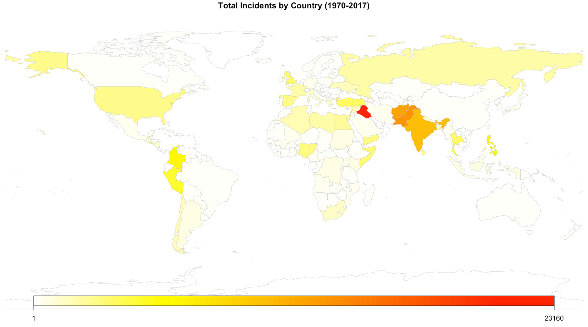
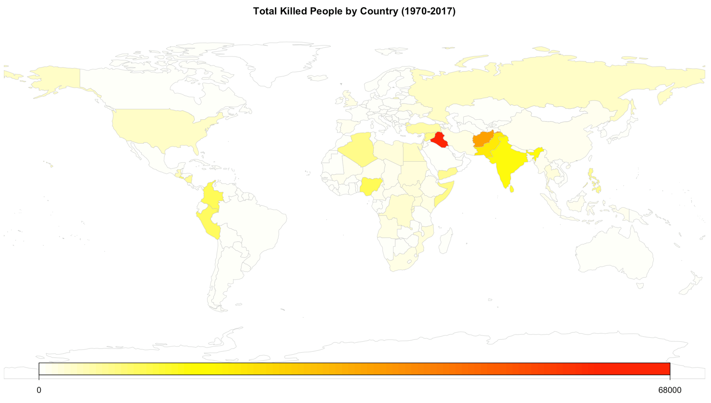

```{r setup, include=FALSE}
knitr::opts_chunk$set(echo = TRUE, fig.width = 7, fig.height = 4)
if(!require("pacman")) install.packages("pacman")
pacman::p_load(dplyr, ggplot2, glmnet, car, randomForest, reshape, gridExtra, forcats)
```

# Executive Summary

Acts of intentional violence at a sub-national level have occurred since the development of civilizations. From religious acts of terror to violence with political intent, terrorism has manifested itself in various forms throughout history. The term itself was developed in the 1790s to describe Maximilien Robespierre's Jacobin regime as the "Reign of Terror", but it was popularized following the 1983 Beirut barracks bombings and the 2001 World Trade Center attacks. These acts of violence, regardless of motive, if successful, often claim the lives of the innocent and bystanders.[1]

This leads to the question - how can people use historical data to predict the outcome of terrorist activity? The answer to this lies in statistical analysis of terrorist incidents. Using location data, attack type, group names, target data, and other past terrorism data, we can apply statistical models to best predict the outcome of events - success, number of killed/wounded, total property damage, etc. With a better understanding of what factors can lead to a foiled or successful attempt, people can better try to prevent such attacks in the future.

We found that the predictors for terrorism varied across different regions (countries), targets, and types. Regions with more political and economic tension tend to have more violent, successful terrorism plots involving many casualties than developed areas. Terrorist incidents targeting local law enforcement tend to occur in large urban centers (cities, towns) in southern regions of the world. Militaries engaging terrorist should be wary of the level of resources available to their enemy; the more similar a terrorist groups is to a militia or PMC (private military contractor), the more successful the terrorists tend to be. Ransom incidents tend to end with more released hostages as the years progress, a positive outlook for the future of combating terrorism.

\newpage

# Data Summary / EDA

## Data Origins

The origins of the data is the Global Terrorism Database (GTD). The GTD was developed by the National Consortium for the Study of Terrorism and Responses to Terrorism (START) at the University of Maryland, College Park, in Maryland, USA. The database contains incidents of terrorism from 1970 to 2017, and is still under development. There are over 181,000 incidents in the database and 135 factors, including a few main factors listed below:

* `iyear`, `imonth`, `iday`: incident year, month, and day
* `country_txt`, `region_txt`, `provstate`, `city`: country, region, providence/state, city names
* `crit1`, `crit2`, `crit3`: which of the three criterion the incident satisfies (see below)
* `attacktype1_txt`: a text descriptor for the attack type; there are other variables regarding the type of attack
* `targtype1_txt`, `targsubtype1_txt`, `natlty1_txt`: a text descriptor for the target type, subtype, and nationality; there are other variables regarding the type of targets
* `gname`, `gnucertain1`, `individual`:  group name, and indicator variables for presence of guns and if individual attack
* `weaptype1_txt`, `weapsubtype1_txt`: type of weapon used in attack
*	`success`, `nkill`, `nwound`, `propextent_txt`: indicates if the incident was successful, the number of killed and wounded, and the extent of property damage (respectively)

To be included in the study, an incident must qualify with three fields:

* The incident must be intentional – the result of a conscious calculation on the part of a
perpetrator.
* The incident must entail some level of violence or immediate threat of violence -including
property violence, as well as violence against people.
* The perpetrators of the incidents must be sub-national actors. The database does not
include acts of state terrorism.

Additionally, it must satisfy two of the following three criterion:

* Criterion 1: The act must be aimed at attaining a political, economic, religious, or social
goal. 
* Criterion 2: There must be evidence of an intention to coerce, intimidate, or convey some
other message to a larger audience (or audiences) than the immediate victims. 
* Criterion 3: The action must be outside the context of legitimate warfare activities. 

In general, the GTD does not include plots that are not enacted or attempted. For an incident to be considered, the attackers must be "out the door", or en route to execute the attack. This means, according to their handbook, "in general if a bomb is planted but fails to detonate; if an arsonist is intercepted by authorities before igniting a fire; or, if an assassin attempts and fails to kill his or her intended target, the attack is considered for inclusion in the GTD, and marked success=0."[2]

## Goal of the study

The goal of the study is to utilize data on terrorist attacks and identify which factors can be best used to predict the outcome of such attacks. In this study, we will be analyzing various outcomes, from success, number of killed, and random outcomes. 

## EDA

```{r data preparation, include=F, cache=TRUE}
data <- read.csv("terrorism.csv")
```

```{r data cleaning, include = F, cache=TRUE}
# filter data
data_clean <- data %>% select(-c(approxdate, resolution, location, summary, alternative, alternative_txt, attacktype2, attacktype2_txt, attacktype3, attacktype3_txt, targtype2, targtype2_txt, targsubtype2, targsubtype2_txt, corp2, target2, natlty2, natlty2_txt, targtype3, targtype3_txt, targsubtype3, targsubtype3_txt, corp3, target3, natlty3, natlty3_txt, gsubname, gname2, gsubname2, gname3, gsubname3, motive, guncertain2, guncertain3, claim2, claimmode2, claimmode2_txt, claim3, claimmode3, claimmode3_txt, compclaim, weaptype1, weapsubtype1, weaptype2, weaptype2_txt, weapsubtype2, weapsubtype2_txt, weaptype3, weaptype3_txt, weapsubtype3, weapsubtype3_txt, weaptype4, weaptype4_txt, weapsubtype4, weapsubtype4_txt, nhostkid, nhostkidus, nhours, ndays, divert, kidhijcountry, ransom, ransomamt, ransomamtus, ransompaid, ransompaidus, ransomnote, hostkidoutcome, hostkidoutcome_txt, nreleased, addnotes, scite1, scite2, scite3, dbsource, INT_LOG, INT_IDEO, INT_MISC, INT_ANY, related, ishostkid)) 

# remove text or IDs
data_clean <- data_clean %>% select(-c(country, region, attacktype1, targtype1, targsubtype1, natlty1, claimmode, propextent, propcomment))

# re-code -9 or -99 to NA
data_clean <- data_clean %>% select(-c(nkillus, nkillter, nwoundus, nwoundte, nperps, nperpcap, claimed, claimmode_txt, property, propvalue, weapdetail, eventid, corp1, target1))
data_clean$vicinity[data_clean$vicinity < 0] <- NA
data_clean$doubtterr[data_clean$doubtterr < 0] <- NA
data_clean <- na.omit(data_clean)
```


```{r categorical, include = F, cache = TRUE}
# make certain predictors factors
data_clean$extended <- as.factor(data_clean$extended)
data_clean$specificity <- as.factor(data_clean$specificity)
data_clean$vicinity <- as.factor(data_clean$vicinity)
data_clean$crit1 <- as.factor(data_clean$crit1)
data_clean$crit2 <- as.factor(data_clean$crit2)
data_clean$crit3 <- as.factor(data_clean$crit3)
data_clean$doubtterr <- as.factor(data_clean$doubtterr)
data_clean$multiple <- as.factor(data_clean$multiple)
data_clean$success <- as.factor(data_clean$success)
data_clean$suicide <- as.factor(data_clean$suicide)
data_clean$guncertain1 <- as.factor(data_clean$guncertain1)
data_clean$individual <- as.factor(data_clean$individual)
```


First, we read in the data given in csv format. There are 181,691 observations and 135 total variables. However, this must be further cleaned. There were three main steps in the data cleaning process for eliminating variables:

1) There were many variables for multiple groups; for instance, there are 3 groups for target (target1, targettype1, targetsubtype1, corp1, target1, natlty1, etc.), 3 groups for attack type, 3 groups for claim, and 3 groups for weapon types. These are present in the case that multiple groups stage an attack, or multiple targets are targeted. However, for the most parts of the dataset, the second and third group for most predictors were NA, and thus were dropped.

2) We filtered variables that were just encodings of other variables. For instance, there were two variables `country` and `country_txt`. The former is a number encoding for a country, while the latter is the name of the country. For purposes of easier readability, we kept the text description. 

3) We finally dropped variables that contained too many NA's. This included number of killed US citizens, group that claimed the incident, etc. Considering the number of US wounded/kill/perp is quite specific, it makes sense that many incident do not report this. Since these caused our models to fail to run, we ended up removing this from the overall data set for the rest of the study.

In general, this final cleaned dataset was used as a baseline for each of our subset analysis. See the appendix for the full list of removed variables. Unless otherwise noted, each subset will be derived from these 31 remaining variables (see below). Additionally, the -9 and -99s that were encoded for missing variables were coded into NA in R. We omitted these NA's from the cleaned dataset due to the large number of examples we had from the database already.

```{r column names, echo = F, cache = TRUE}
colnames(data_clean)
```

Let's first get a sense of the (cleaned) dataset as a whole. Through the summary of the dataset (see Appendix for full summary), we can elucidate a few key insights from the data. Dropping the NA's yielded 148,627 observations on 31 variables. 

```{r dim, echo = F}
dim(data_clean)
```

The years range from 1970 to 2017, with a huge left skew in data, meaning there are a lot more reported incidents in the recent years, which makes sense given the development of the Internet. Additionally, there are significantly more successful than unsuccessful incidents, likely due to the fact that only incidents where the perpetrators were "out of the door" were recorded, as aforementioned.

```{r histogram, echo = F}
par(mfrow = c(1, 2))
ggplot(data = data_clean, aes(x=iyear)) + geom_histogram(fill = 'orange', colour='blue') + labs(x='Year', y='Count', title='Histogram of Incidents by year')
ggplot(data = data_clean, aes(x=success)) + geom_bar(fill = 'red') + labs(x='Success', y='Count', title='Barplot of successful incidents')
# hist(data_clean$iyear, main = "Histogram of incidents by year")
# plot(data_clean$success, main ="Barplot of successful incidents")
```

From the histogram of incidents by year, it is clear that there is an influx of recent events, so it makes sense to generate a subset of data for recent events as well as those from past events. Thus, we created two subset splits, one for data from 2017, and one for data from 1997-2016. We choose the range 1997-2016 because before 1997, our GTD is quite space for some variables. This ensures we still have comparable datasets with similar sparsity.

```{r, include=F}
# Take the most recent year, as well as all of the recent years
data_2017 <- data_clean %>% filter(iyear == 2017)
data_1997 <- data_clean %>% filter(iyear >= 1997 & iyear <= 2016)
```

Looking at the summary of the number of number of killed and wounded (respectively), we see that on average there are 2.192 killed and 3.408 wounded, but the medians are both 0. The maximum of these incidents were both the tragic attack on the World Trade Center on 9/11/2001. 

```{r nkill nwound, echo = F}
summary(data_clean$nkill)
summary(data_clean$nwound)
```

Looking at the types of attacks, the top 5 weapons of choice range from explosives and firearms down to melee incidents. The most frequent 4 groups (the top factor was "Unknown") were Taliban, ISIL, Shining Path, and New People's Army.

```{r graphs, echo = F}
par(mfrow = c(1, 2))

barplot(sort(table(data_clean$weaptype1_txt), decreasing=TRUE)[1:5], main = "5 most frequent weapon types")
barplot(sort(table(data_clean$gname), decreasing=TRUE)[2:5], main="4 most frequent groups")
```

To view a geographical distribution of the incidents, we plot the total killed as a function of country location on a global map. We see that there is a large number of incidents in Iraq, as well as the South Asian region of Afghanistan, Pakistan, and India. Something worthy of noting is also the small, but still significant number of incidents in the USA, Western Europe, and South America.

```{r world map count, echo = F}
pacman::p_load(rworldmap)
worldmap_data <- aggregate(success~country_txt,data_clean,length)

#join data to a map
map <- joinCountryData2Map(worldmap_data, 
                               nameJoinColumn="country_txt", 
                               joinCode="NAME")

mapDevice() #create a world shaped window

#plot the map
mapCountryData(map, 
                nameColumnToPlot='success', 
               mapTitle = 'Total Incidents by Country (1970-2017)',
                catMethod='fixedWidth', 
                numCats=100)
```



A similar map to look at, the aggregate number of people killed by country, displays similar information. However, it is notable that in this chloropleth, the shade of some South Asian countries (notably India), as well as many countries in Western Europe and the USA, drop off significantly. This signifies that while there are a large number of incidents in these countries, either they do not end up being successful, or are stopped at the source quickly. This makes these countries worthy of further examination.

```{r world map nkill, echo = F}
worldmap_data2 <- aggregate(nkill~country_txt,data_clean,sum)

#join data to a map
map2 <- joinCountryData2Map(worldmap_data2, 
                               nameJoinColumn="country_txt", 
                               joinCode="NAME")

mapDevice() #create a world shaped window

#plot the map
mapCountryData(map2, 
                nameColumnToPlot='nkill', 
               mapTitle = 'Total Killed People by Country (1970-2017)',
                catMethod='fixedWidth', 
                numCats=100)
```



Based on these maps, it makes sense to also subset out specific countries. Thus, we developed a subset for 1) Iraq, the country with by far the most incidents and total number killed, 2) the USA, given the fact that we are based in the USA and for the large number of unsuccessful or small incidents, 3) Japan, for being a country with a small number of incidents and number killed, and 4) Syria, for the recent developments of the Syrian Civil War. For larger context of countries that score high on the Human Development Index (HDI), we also subset off a developed countries dataset, consisting of those located in North America, Western Europe, and East Asia.

Some final subsets that we created were for the target type, and the type of attack. Based on the target types, we created a subset for 1) attacks on police, 2) attacks on military, and 3) attacks on police agencies. Due to the armed nature of these bodies, it makes sense to branch these off to separate subsets to analyze if it results in a change in the number of successful attacks and killed people. Additionally, with a large number of predictors based on property damage and also for kidnappings / ransoms, we subset both of these into their own datasets for analysis.

```{r, include = F}
# subsets
data_usa <- data_clean %>% filter(country_txt == "United States")
data_usa <- data_usa[, sapply(data_usa, function(c) length(unique(c))) > 1]

data_iraq <- data_clean %>% filter(country_txt == "Iraq")
data_iraq <- data_iraq[, sapply(data_iraq, function(c) length(unique(c))) > 1]

data_syria <- data_clean %>% filter(country_txt == "Syria")
data_syria <- data_syria[, sapply(data_syria, function(c) length(unique(c))) > 1]

data_japan <- data_clean %>% filter(country_txt == "Japan")
data_japan <- data_japan[, sapply(data_japan, function(c) length(unique(c))) > 1]

data_developed <- data_clean %>% filter(region_txt == "North America" | region_txt == "Western Europe" | region_txt == "East Asia")
data_developed <- data_developed[, sapply(data_developed, function(c) length(unique(c))) > 1]

data_police <- data_clean %>% filter(targtype1_txt == 'Police') 
data_police <- data_police[, sapply(data_police, function(c) length(unique(c))) > 1]

data_military <- data_clean %>% filter(targtype1_txt == 'Military')
data_military <- data_military[, sapply(data_military, function(c) length(unique(c))) > 1]

data_government <- data_clean %>% filter(targtype1_txt == "Government (General)" | targtype1_txt == "Government (Diplomatic)")
data_government <- data_government[, sapply(data_government, function(c) length(unique(c))) > 1]

data_property <- data_clean %>% filter(propextent_txt != "")
data_property <- data_property[, sapply(data_property, function(c) length(unique(c))) > 1]

```


```{r, include = F}
# Subsets that require further cleaning!

# filter data
data_ransom <- data %>% select(-c(approxdate, resolution, location, summary, alternative, alternative_txt, attacktype2, attacktype2_txt, attacktype3, attacktype3_txt, targtype2, targtype2_txt, targsubtype2, targsubtype2_txt, corp2, target2, natlty2, natlty2_txt, targtype3, targtype3_txt, targsubtype3, targsubtype3_txt, corp3, target3, natlty3, natlty3_txt, gsubname, gname2, gsubname2, gname3, gsubname3, motive, guncertain2, guncertain3, claim2, claimmode2, claimmode2_txt, claim3, claimmode3, claimmode3_txt, compclaim, weaptype1, weapsubtype1, weaptype2, weaptype2_txt, weapsubtype2, weapsubtype2_txt, weaptype3, weaptype3_txt, weapsubtype3, weapsubtype3_txt, weaptype4, weaptype4_txt, weapsubtype4, weapsubtype4_txt, nhostkid, nhostkidus, nhours, ndays, divert, kidhijcountry, addnotes, scite1, scite2, scite3, dbsource, INT_LOG, INT_IDEO, INT_MISC, INT_ANY, related)) 

# remove text or IDs
data_ransom <- data_ransom %>% select(-c(country, region, attacktype1, targtype1, targsubtype1, natlty1, claimmode, propextent, propcomment))
data_ransom <- data_ransom %>% filter(ransom == 1)
data_ransom <- data_ransom %>% select(-c(nkillus, nkillter, nwoundus, nwoundte, nperps, nperpcap, claimed, claimmode_txt, property, propvalue, weapdetail, eventid, corp1, target1))
data_ransom$vicinity[data_ransom$vicinity < 0] <- NA
data_ransom$doubtterr[data_ransom$doubtterr < 0] <- NA
data_ransom$ishostkid[data_ransom$ishostkid < 0] <- NA
data_ransom <- na.omit(data_ransom)
```

Out of curiosity, we make a plot of total terrorist attacks by state in the USA. Note that there are a significant number of attacks in New York and California, but even populous states like Texas and Florida have a significantly less number of attacks. 

```{r, echo = F}
usa_map <- data_usa %>%
  group_by(provstate) %>%
  summarise(
    nkill_total=sum(nkill),
    n=n())

usa_map <- usa_map[, c("provstate", "n")]
usa_map <- usa_map[-c(1, 10, 41, 47), ]
usa_map$center_lat  <- state.center$x
usa_map$center_long <- state.center$y
usa_map$region <- tolower(usa_map$provstate)
usa_map$abb <- setNames(state.abb, state.name)[as.vector(usa_map$provstate)]
states <- map_data("state") 
map <- merge(states, usa_map, sort=FALSE, by="region", all.x=TRUE)
map <- map[order(map$order),]
ggplot(map, aes(x=long, y=lat, group=group))+
  geom_polygon(aes(fill=n))+
  geom_path()+ 
  geom_text(data=usa_map, aes(x=center_lat, y=center_long, group=NA, 
                             label=abb, size=2), show.legend =FALSE)+
  scale_fill_continuous(limits=c(1, 550),name="Terrorist Attacks by State",
                        low="light blue", high="dark blue")   # you may play the colors here
```

It is extremely interesting when plotting this in comparison to the number of deaths by state, as seen below. The number of deaths in California, as well as of any other state, are dwarfed by the number of deaths in the 9/11 attacks in New York. Looking at the actual dataframe, while California has 534 attacks, the most in the nation, it is surpassed by New York, Virginia, and Oklahoma in terms of number of deaths. This could be because many of the attempts are unsuccessful, or are stopped before they can worsen.

```{r, echo = F}
usa_map <- data_usa %>%
  group_by(provstate) %>%
  summarise(
    nkill_total=sum(nkill),
    n=n())

usa_map <- usa_map[, c("provstate", "nkill_total")]
usa_map <- usa_map[-c(1, 10, 41, 47), ]
usa_map$center_lat  <- state.center$x
usa_map$center_long <- state.center$y
usa_map$region <- tolower(usa_map$provstate)
usa_map$abb <- setNames(state.abb, state.name)[as.vector(usa_map$provstate)]
states <- map_data("state") 
map <- merge(states, usa_map, sort=FALSE, by="region", all.x=TRUE)
map <- map[order(map$order),]
ggplot(map, aes(x=long, y=lat, group=group))+
  geom_polygon(aes(fill=nkill_total))+
  geom_path()+ 
  geom_text(data=usa_map, aes(x=center_lat, y=center_long, group=NA, 
                             label=abb, size=2), show.legend =FALSE)+
  scale_fill_continuous(limits=c(0, 3000),name="Number of Deaths by State",
                        low="light blue", high="dark blue")   # you may play the colors here
```

Let's do a correlation heatmap for all the numeric values in the dataset. While all of these pairings do not make the most logical sense to correlate, it is good reaffirmation to see some of the values. There does not seem to be a correlation between the dates of the attacks, and latitude and longitude are very mildly, but significantly correlated. It is also good reaffirmation to see that the number of wounded and number of killed are highly correlated.
```{r correlation, echo = F}
plotData <-melt(cor(data_clean[sapply(data_clean, is.numeric)]))

ggplot(plotData ,
    aes(x = X1, y = X2, fill =value)) +
    geom_tile() +
    ylab("") +
    xlab("") +
scale_x_discrete(limits = rev(levels(plotData $X2))) + #Flip the x- or y-axis
    scale_fill_gradient( low = "#56B1F7", high = "#132B43") +     #lightblue to darkblue
    #scale_fill_gradient( low = "white", high = "black") + #white to black
       guides(fill = guide_legend(title = "Correlation"))
```


Before we go onto the analysis, we will collapse all factor levels into the top 5 + an other category to improve the runtime of our code for dataset we are predicting on `success`. If we were to include all 3537 levels of variables like `gname`, then our classification models would take too long to train. See the appendix for the code to collapse factors with many levels.

```{r collapse levels, include=F, cache=TRUE}
collapse <- function(d, type=''){
  tgt_cols <- colnames(d)[sapply(d, function(x) length(levels(x))) > 6]
  
  for (col in tgt_cols) {
    if (col != type) {
      sorted <- sort(table(d[,col]), decreasing=TRUE)
      top5 <- sorted[1:5]
      if ('Unknown' %in% names(top5)) {
        top5[names(sorted[6])] <- sorted[[6]]
      }
    
      d[,col] <- fct_collapse(d[,col], 'Unknown' = levels(d[,col])[!(levels(d[,col]) %in% names(top5))])
    }
  }
}
```

```{r, include = F}
# subsets
data_developed <- data_clean %>% filter(region_txt == "North America" | region_txt == "Western Europe" | region_txt == "East Asia")
collapse(data_developed, type='region_txt')
data_developed <- data_developed[, sapply(data_developed, function(c) length(unique(c))) > 1]

data_police <- data_clean %>% filter(targtype1_txt == 'Police') 
collapse(data_police, type='targtype1_txt')
data_police <- data_police[, sapply(data_police, function(c) length(unique(c))) > 1]

data_military <- data_clean %>% filter(targtype1_txt == 'Military')
collapse(data_military, type='targtype1_txt')
data_military <- data_military[, sapply(data_military, function(c) length(unique(c))) > 1]

data_government <- data_clean %>% filter(targtype1_txt == "Government (General)" | targtype1_txt == "Government (Diplomatic)")
collapse(data_government, type='targtype1_txt')
data_government <- data_government[, sapply(data_government, function(c) length(unique(c))) > 1]

data_property <- data_clean %>% filter(propextent_txt != "")
collapse(data_property, type='propextent_txt')
data_property <- data_property[, sapply(data_property, function(c) length(unique(c))) > 1]

```


# Findings / Analysis

## Entire Dataset Analysis

We will start with the whole dataset `data_clean` and by training a classifier on `nkill` with a logistic classifier. We will run cv.glm with $\alpha=1$ to run LASSO regression for model selection. Once we take the smallest model at most 1 std deviation of cross-validated mean errors away from the minimum cvm, we will run Anova() iteratively to remove the most insignificant grouping until all predictors are significant at the $\alpha=0.01$ level.

Note that for this specific subset of the data, we will use `lambda.min` instead of `lambda.1se` as `lambda.1se` implies a model with 0 nonzero coefficeints (essentially, just an intercept). Thus for feasibility, we will use `lambda.min`.

```{r, entire set, echo=F, cache=TRUE}
set.seed(1)
Y <- data_clean[,'nkill']
X <- model.matrix(data=data_clean, nkill~. -nwound -country_txt - provstate - city - targsubtype1_txt - natlty1_txt - gname)[,-1]

lasso_clean <- cv.glmnet(x=X, y=Y, alpha=1, nfold=10)
plot(lasso_clean)

lasso_clean_min <- coef(lasso_clean, s='lambda.min')
lasso_clean_min <- lasso_clean_min[which(lasso_clean_min != 0),]
input <- rownames(as.matrix(lasso_clean_min))
if (input[1] == '(Intercept)') {
  input <- input[-1]
}
input <- as.formula('nkill ~ iyear + extended + region_txt + latitude + specificity + vicinity + crit1 + crit2 + crit3 + doubtterr + multiple + success + suicide + attacktype1_txt + targtype1_txt + guncertain1 + individual + weaptype1_txt + weapsubtype1_txt + propextent_txt')

lasso_clean <- lm(input, data=data_clean)
```

```{r entire set lasso anova, include=F, cache=T}
suppressWarnings(clean_anova <- Anova(lasso_clean))
clean_anova <- clean_anova[!is.na(clean_anova[,4]),]
alpha = 0.01
while (TRUE) {
  if (max(clean_anova[,4]) > alpha) {
    target <- rownames(clean_anova[which.max(clean_anova[,4]),]) 
    print(target)
    suppressWarnings(lasso_clean <- update(lasso_clean, as.formula(paste('.~.', ' - ', target))))
    suppressWarnings(clean_anova <- Anova(lasso_clean))
    clean_anova <- clean_anova[!is.na(clean_anova[,4]),]
  } else {
    break
  }
}
```

Adjusted R-Squared for Entire Dataset (LASSO): `r summary(lasso_clean)$adj.r.squared`

RSE for Entire Dataset (LASSO): `r summary(lasso_clean)$sigma`

From these R-Squared values, it seems that the model is not able to explain a lot of variance in the nkill dataset, but with a pvalue of 2.2e-16, the model does seem significant in that regard. Due to the poor performance of the model on the overall dataset, we subset the data into smaller datasets to use for further analysis.


## Data by Country

Let us take a look at the differences between countries, namely Iraq, Japan, USA, and Syria. We will build a linear regression model through LASSO (cvglm) and run Anova() to remove (backward select out) categories that are not significant at the $\alpha=0.01$ level.

Starting with Japan, we first remove `nwound` before modeling building as it would be highly correlated with `nikill`. In reality, we can't really use `nwound` to predict `nkill` as they occur at the same time (it makes sense that more wounded implies more killed, and vice versa). We are interested in deeper relations, if they exist. The summaries can be found in the appendix.

Below is our graph of cross-validated mean errors.

```{r japan lasso, include=T, echo=F, cache=T}
set.seed(1)
Y <- data_japan[,'nkill']
X <- model.matrix(data=data_japan, nkill~.- nwound - provstate - city - targsubtype1_txt - natlty1_txt - gname)[,-1]

lasso_japan <- cv.glmnet(x=X, y=Y, alpha=1, nfold=10)
lasso_japan_plot <- lasso_japan
plot(lasso_japan_plot)

lasso_japan_min <- coef(lasso_japan, s='lambda.min')
lasso_japan_min <- lasso_japan_min[which(lasso_japan_min != 0),]
input <- rownames(as.matrix(lasso_japan_min))
if (input[1] == '(Intercept)') {
  input <- input[-1]
}
input <- as.formula('nkill ~ success + attacktype1_txt + targtype1_txt + weaptype1_txt')

lasso_japan <- lm(input, data=data_japan)
```

```{r japan lasso anova, include=F, cache=T}
suppressWarnings(japan_anova <- Anova(lasso_japan))
japan_anova <- japan_anova[!is.na(japan_anova[,4]),]
alpha = 0.01
while (TRUE) {
  if (max(japan_anova[,4]) > alpha) {
    target <- rownames(japan_anova[which.max(japan_anova[,4]),]) 
    print(target)
    suppressWarnings(lasso_japan <- update(lasso_japan, as.formula(paste('.~.', ' - ', target))))
    suppressWarnings(japan_anova <- Anova(lasso_japan))
    japan_anova <- japan_anova[!is.na(japan_anova[,4]),]
  } else {
    break
  }
}
```

Adjusted R-Squared for Japan (LASSO): `r summary(lasso_japan)$adj.r.squared`

RSE for Japan (LASSO): `r summary(lasso_japan)$sigma`

Let us also try running random forest model on this dataset. We must remove  `provstate`, `city`, `targsubtype_txt`, `natlty1_txt`, and `gname` as they have over 53 levels. We tuned our random forest appropriately with `mtry` and `ntree`. Displayed is the MSE of our RF:

```{r japan rf, include=T, echo=F, cache=T}
# rf_japan
set.seed(1)
#lol doesn't run too large still
rf_japan <- randomForest(data=data_japan, nkill~.- nwound - provstate - city - targsubtype1_txt - natlty1_txt - gname, mtry=8, ntree=150)
ggplot() + geom_line(aes(x=1:rf_japan$ntree, y=rf_japan$mse)) + labs(x= 'Number of Trees', y= 'MSE', title = 'Random Forest MSE for data_japan on nkill')
```

MSE at 150 trees: `r rf_japan$mse[150]`


The same approaches were applied the USA, Syria, and Iraq. Their outputs are shown in the appendix and the overall summaries are:

```{r usa lasso, include=F, cache=T}
set.seed(1)
Y <- data_usa[,'nkill']
X <- model.matrix(data=data_usa, nkill~.- nwound - provstate - city - targsubtype1_txt - natlty1_txt - gname)[,-1]

lasso_usa <- cv.glmnet(x=X, y=Y, alpha=1, nfold=10)
lasso_usa_plot <- lasso_usa

lasso_usa_min <- coef(lasso_usa, s='lambda.min')
lasso_usa_min <- lasso_usa_min[which(lasso_usa_min != 0),]
input <- rownames(as.matrix(lasso_usa_min))
if (input[1] == '(Intercept)') {
  input <- input[-1]
}
input <- as.formula('nkill ~ vicinity + propextent_txt')

lasso_usa <- lm(input, data=data_usa)
```

```{r usa lasso anova, include=F, cache=T}
suppressWarnings(usa_anova <- Anova(lasso_usa))
usa_anova <- usa_anova[!is.na(usa_anova[,4]),]
alpha = 0.01
while (TRUE) {
  if (max(usa_anova[,4]) > alpha) {
    target <- rownames(usa_anova[which.max(usa_anova[,4]),]) 
    print(target)
    suppressWarnings(lasso_usa <- update(lasso_usa, as.formula(paste('.~.', ' - ', target))))
    suppressWarnings(usa_anova <- Anova(lasso_usa))
    usa_anova <- usa_anova[!is.na(usa_anova[,4]),]
  } else {
    break
  }
}
```

```{r usa rf, include=F, cache=T}
# rf_usa
set.seed(1)
#lol doesn't run too large still
rf_usa <- randomForest(data=data_usa, nkill~.- nwound - provstate - city - targsubtype1_txt - natlty1_txt - gname, mtry=8, ntree=150)
ggplot() + geom_line(aes(x=1:rf_usa$ntree, y=rf_usa$mse)) + labs(x= 'Number of Trees', y= 'MSE', title = 'Random Forest MSE for data_usa on nkill')
```


```{r syria lasso, include=F, cache=T}
set.seed(1)
Y <- data_syria[,'nkill']
X <- model.matrix(data=data_syria, nkill~.- nwound - provstate - city - targsubtype1_txt - natlty1_txt - gname)[,-1]

lasso_syria <- cv.glmnet(x=X, y=Y, alpha=1, nfold=10)
lasso_syria_plot <- lasso_syria

lasso_syria_min <- coef(lasso_syria, s='lambda.min')
lasso_syria_min <- lasso_syria_min[which(lasso_syria_min != 0),]
input <- rownames(as.matrix(lasso_syria_min))
if (input[1] == '(Intercept)') {
  input <- input[-1]
}
input <- as.formula('nkill ~ iyear + imonth + extended + longitude + specificity + crit1 + crit2 + crit3 + doubtterr + success + suicide + attacktype1_txt + targtype1_txt + weapsubtype1_txt + propextent_txt')

lasso_syria <- lm(input, data=data_syria)
```

```{r syria lasso anova, include=F, cache=T}
suppressWarnings(syria_anova <- Anova(lasso_syria))
syria_anova <- syria_anova[!is.na(syria_anova[,4]),]
alpha = 0.01
while (TRUE) {
  if (max(syria_anova[,4]) > alpha) {
    target <- rownames(syria_anova[which.max(syria_anova[,4]),]) 
    print(target)
    suppressWarnings(lasso_syria <- update(lasso_syria, as.formula(paste('.~.', ' - ', target))))
    suppressWarnings(syria_anova <- Anova(lasso_syria))
    syria_anova <- syria_anova[!is.na(syria_anova[,4]),]
  } else {
    break
  }
}
```

```{r syria rf, include=F, cache=T}
# rf_syria
set.seed(1)
#lol doesn't run too large still
rf_syria <- randomForest(data=data_syria, nkill~.- nwound - provstate - city - targsubtype1_txt - natlty1_txt - gname, mtry=8, ntree=150)
ggplot() + geom_line(aes(x=1:rf_syria$ntree, y=rf_syria$mse)) + labs(x= 'Number of Trees', y= 'MSE', title = 'Random Forest MSE for data_syria on nkill')
```


```{r iraq lasso, include=F, cache=T}
set.seed(1)
Y <- data_iraq[,'nkill']
X <- model.matrix(data=data_iraq, nkill~.- nwound - provstate - city - targsubtype1_txt - natlty1_txt - gname )[,-1]

lasso_iraq <- cv.glmnet(x=X, y=Y, alpha=1, nfold=10)
lasso_iraq_plot <- lasso_iraq

lasso_iraq_min <- coef(lasso_iraq, s='lambda.min')
lasso_iraq_min <- lasso_iraq_min[which(lasso_iraq_min != 0),]
input <- rownames(as.matrix(lasso_iraq_min))
if (input[1] == '(Intercept)') {
  input <- input[-1]
}
input <- as.formula('nkill ~ iyear + imonth + iday + extended + latitude + longitude + specificity + crit1 + crit2 + doubtterr + multiple + success + suicide + attacktype1_txt + targtype1_txt + guncertain1 + + weapsubtype1_txt + propextent_txt')

lasso_iraq <- lm(input, data=data_iraq)
```

```{r iraq lasso anova, include=F, cache=T}
suppressWarnings(iraq_anova <- Anova(lasso_iraq))
iraq_anova <- iraq_anova[!is.na(iraq_anova[,4]),]
alpha = 0.01
while (TRUE) {
  if (max(iraq_anova[,4]) > alpha) {
    target <- rownames(iraq_anova[which.max(iraq_anova[,4]),]) 
    print(target)
    suppressWarnings(lasso_iraq <- update(lasso_iraq, as.formula(paste('.~.', ' - ', target))))
    suppressWarnings(iraq_anova <- Anova(lasso_iraq))
    iraq_anova <- iraq_anova[!is.na(iraq_anova[,4]),]
  } else {
    break
  }
}
```

```{r iraq rf, include=F, cache=T}
# rf_iraq
set.seed(1)
#lol doesn't run too large still
rf_iraq <- randomForest(data=data_iraq, nkill~.- nwound - provstate - city - targsubtype1_txt - natlty1_txt - gname, mtry=3, ntree=50)
ggplot() + geom_line(aes(x=1:rf_iraq$ntree, y=rf_iraq$mse)) + labs(x= 'Number of Trees', y= 'MSE', title = 'Random Forest MSE for data_iraq on nkill')
```


```{r country table, echo=F}
country_table <- data.frame('Adjusted R-Squared (LASSO)' = c(summary(lasso_japan)$adj.r.squared, summary(lasso_usa)$adj.r.squared, summary(lasso_syria)$adj.r.squared, summary(lasso_iraq)$adj.r.squared), 'RSE (LASSO)' = c(summary(lasso_japan)$sigma, summary(lasso_usa)$sigma, summary(lasso_syria)$sigma, summary(lasso_iraq)$sigma), 'MSE of Random Forest' = c(rf_japan$mse[150], rf_usa$mse[150], rf_syria$mse[150], rf_iraq$mse[50]) )
rownames(country_table) <- c('Japan', 'USA', 'Syria', 'Iraq')

grid.table(country_table)
```

Taking a look at the Anova() and full summary outputs in the Appendix, we see some interesting findings:

For Japan, our most significant variable is `attacktype1_txtHostage Taking (Barricade Incident)`. Examining the japan dataset we see two data points where this categorical level is true:

```{r japan detail table, echo=F}
grid.table(data.frame(data_japan[data_japan$attacktype1_txt == 'Hostage Taking (Barricade Incident)',])[,c('provstate', 'city', 'attacktype1_txt', 'nkill', 'nwound')])
```

We see that only the incident in Kanagawa/Sagamihara actually involved any target deaths (with a decent number of 26 people wounded). It seems that this model has overfit to this single datapoint.

For the USA, we find a much simpler model with only 5 predictors (vicinity and the 4 levels of `propextent_txt`). `propextent_txtCatastrophic (likely >= $1 billion)` is the most significant predictor holding all other constant, followed by `vicinity1`. The former maybe due to the tragic 9/11 incident which is clearly in the Catastrophic level for property damage; this maybe another case of overfitting to a single point of extreme noise. The latter (`vicinity1`) suggests that large centers of population have more targets killed. This may simply be due to population density and also does not serve as a good predictor.

For Syria, there are a lot more predictors than in the USA or Japan dataset (suggesting a complexity of terrorism characterizations in this area). More notably, we see that `crit3` is highly significant. `crit3` incidents are described as "Outside International Humanitarian Law", which aligns with the modern day rising refugee crisis. Additionally, `suicide`, `weapsubtype1_txtAutomatic or Semi-Automatic Rifle`, and `weapsubtype1_txtVehicle` are quite good predictors of `nkill`. This seems to differ from the tools used by terrorists in developed countries such as Japan and the US.

For Iraq, we see that some noteworthy significant predictors are `iyear`, `extended`, `crit1`, `suicide`, as well as many `attacktype1_txt` and `weapsubtype1_txt` levels such as Assassination, Bombing, Infrastructure, Hostages, Arson, and Automatic/semi rifle/guns. Given that most of our data is recent (with post-1997 incidents better reported than those before), it makes sense that Iraq appears to be the most violent region. The early 2000s War on Terror may play a role in influencing so many military-ques incidents, though such a thought is only a conjecture; we would need more complex analyses to test that hypothesis. Regardless, it seems deadly terrorism incidents in Iraq are mainly influenced by extended, political/economic/religious, military aggression.


## Data by Target

For our datasets by target of `police`, `military`, and `police`, we will train a classification model to predict on `success`. This is because we expected a lower number of deaths if these terror incidents are more specifically targeted. We are instead interested in seeing how different target entities resist terrorist attacks, or if the profiles of terrorists differ across targets.

We will use a logistic regression selected through cross-validation, then backwards select out using Anova(). Here is a sample cross-validated deviance graph by lambda value for government. The remaining relevant outputs are in the Appendix.

```{r govenment lasso, echo=F, cache=TRUE}
set.seed(1)
Y <- data_government[,'success']
X <- model.matrix(data=data_government, success~. - provstate - city - targtype1_txt - targsubtype1_txt - natlty1_txt - gname)[,-1]

lasso_government <- cv.glmnet(x=X, y=Y, alpha=1, nfold=10, family='binomial')
lasso_government_plot <- lasso_government
suppressWarnings(plot(lasso_government_plot))

lasso_government_min <- coef(lasso_government, s='lambda.1se')
lasso_government_min <- lasso_government_min[which(lasso_government_min != 0),]
input <- rownames(as.matrix(lasso_government_min))
if (input[1] == '(Intercept)') {
  input <- input[-1]
}
input <- as.formula('success ~ iyear + imonth + extended + region_txt + latitude + longitude + vicinity + crit2 + doubtterr + multiple + suicide + attacktype1_txt + targtype1_txt + weaptype1_txt + guncertain1 + individual + weapsubtype1_txt + nkill + propextent_txt')

suppressWarnings(lasso_government <- glm(input, data=data_government, family = 'binomial'))
```

```{r government anova, include = F, warn = F, cache=TRUE}
government_anova <- Anova(lasso_government)
government_anova <- government_anova[!is.na(government_anova[,3]),]
alpha = 0.01
while (TRUE) {
  if (max(government_anova[,3]) > alpha) {
    target <- rownames(government_anova[which.max(government_anova[,3]),]) 
    print(target)
    lasso_government <- update(lasso_government, as.formula(paste('.~.', ' - ', target)))
    government_anova <- Anova(lasso_government)
    government_anova <- government_anova[!is.na(government_anova[,3]),]
  } else {
    break
  }
}
```


```{r military lasso, include=F, cache=TRUE}
set.seed(1) 
Y <- data_military[,'success']
X <- model.matrix(data=data_military, success~. - provstate - city - targsubtype1_txt - natlty1_txt - gname)[,-1]

lasso_military <- cv.glmnet(x=X, y=Y, alpha=1, nfold=10, family='binomial')
lasso_military_plot <- lasso_military
plot(lasso_military_plot)

lasso_military_min <- coef(lasso_military, s='lambda.1se')
lasso_military_min <- lasso_military_min[which(lasso_military_min != 0),]
input <- rownames(as.matrix(lasso_military_min))
if (input[1] == '(Intercept)') {
  input <- input[-1]
}
input <- as.formula('success ~ iyear + iday + extended + region_txt + vicinity + latitude + crit1 + doubtterr + multiple + suicide + attacktype1_txt + guncertain1 + individual + weapsubtype1_txt + nkill + nwound + propextent_txt')

lasso_military <- glm(input, data=data_military, family = 'binomial')
```

```{r military anova, include = F, warn = F, cache=TRUE}
military_anova <- Anova(lasso_military)
military_anova <- military_anova[!is.na(military_anova[,3]),]
alpha = 0.01
while (TRUE) {
  if (max(military_anova[,3]) > alpha) {
    target <- rownames(military_anova[which.max(military_anova[,3]),]) 
    print(target)
    lasso_military <- update(lasso_military, as.formula(paste('.~.', ' - ', target)))
    military_anova <- Anova(lasso_military)
    military_anova <- military_anova[!is.na(military_anova[,3]),]
  } else {
    break
  }
}
```


```{r police lasso, include=F, cache=TRUE}
set.seed(1)
Y <- data_police[,'success']
X <- model.matrix(data=data_police, success~. - provstate - city - targsubtype1_txt - natlty1_txt - gname)[,-1]

lasso_police <- cv.glmnet(x=X, y=Y, alpha=1, nfold=10, family='binomial')
lasso_police_plot <- lasso_police
plot(lasso_police_plot)

lasso_police_min <- coef(lasso_police, s='lambda.1se')
lasso_police_min <- lasso_police_min[which(lasso_police_min != 0),]
input <- rownames(as.matrix(lasso_police_min))
if (input[1] == '(Intercept)') {
  input <- input[-1]
}
input <- as.formula('success ~ iyear + extended + region_txt + latitude + specificity + crit1 + doubtterr + multiple + suicide + attacktype1_txt + weaptype1_txt + individual + weapsubtype1_txt + nkill + nwound + propextent_txt')

lasso_police <- glm(input, data=data_police, family = 'binomial')
```

```{r police anova, include = F, warn = F, cache=TRUE}
police_anova <- Anova(lasso_police)
police_anova <- police_anova[!is.na(police_anova[,3]),]
alpha = 0.01
while (TRUE) {
  if (max(police_anova[,3]) > alpha) {
    target <- rownames(police_anova[which.max(police_anova[,3]),]) 
    print(target)
    lasso_police <- update(lasso_police, as.formula(paste('.~.', ' - ', target)))
    police_anova <- Anova(lasso_police)
    police_anova <- police_anova[!is.na(police_anova[,3]),]
  } else {
    break
  }
}
```


```{r target table, echo=F}
target_table <- data.frame('Residual Deviance (LASSO)' = c(summary(lasso_government)$deviance, summary(lasso_military)$deviance, summary(lasso_police)$deviance), 'Cross-validated Accuracy' = c(mean(as.numeric(predict(lasso_government, data_government) > 0.5)), mean(as.numeric(predict(lasso_military, data_military) > 0.5)), mean(as.numeric(predict(lasso_police, data_police) > 0.5))) )
rownames(target_table) <- c('Government', 'Military', 'Police')

grid.table(target_table)
```


Taking a look at the government dataset, we have no variables of real surprise. Assassination, Bombing, Infrastructure, Hostage seem to be strong predictors. Otherwise, we find it somewhat surprising that `crit1` was not chosen as it relates to politically charged terror attacks.

In the military dataset, we see nearly all standard military equipment in weapsubtype are significant; this includes levels such as rifles, explosives, handguns, knives, pipe bombs, time bombs, projectiles, and even vehicles. The scale of terrorism (maybe even warfare in this category) is clearly much higher as successful terrorist must be well equipped to target a military entity(s).

As for the police dataset, we see some interesting predictors that relate to geographical attributes. `latitude`, `specificity2`, and `specificity3` are very significant (holding each other and all other predictors constant) at predicting success:

```{r police lat and spec3 table, echo=F}
grid.table( data.frame(coef(summary(lasso_police))[c(2,3,4),c(1,4)] ) )
```

More specifically, latitude decreases the log-odds ration of success by `r coef(summary(lasso_police))[c(2),1]` per 1 degree increase in latitude; the more north we go, the less likely a police-targeted terror attack succeeds. `specificity` records how granular the location data is; it discretely ranges from 1 (meaning lat/lang of the city/town in known) to 4 (meaning no 1st order administrative region is known). The presence of `specificity2`, and `specificity3` also decrease the log-odds ration by `r coef(summary(lasso_police))[c(3),1]` and `r coef(summary(lasso_police))[c(4),1]` of success respectively. In general, southern large cities are more likely to be hit by successful terror attacks targeting the police. These may be areas of political unrest where anti-government rebel groups are common.


## Data by Type

We tested a subset of data on only attacks where hostages were taken and some form of a ransom was demanded. These were interesting because these attacks have all been successful - some form of kidnapping has taken place - but the event is not over. We take the other predictors in the dataset and predict on if the kidnapping will be resolved successfully (release of the hostages or successful rescue), or not. 

```{r clean ransom, include = F}
data_ransom$ransomamt[data_ransom$ransomamt < 0] <- 0
data_ransom$ransomamtus[data_ransom$ransomamtus < 0] <- 0
data_ransom$ransompaid[data_ransom$ransompaid < 0] <- 0
data_ransom$ransompaidus[data_ransom$ransompaidus < 0] <- 0
data_ransom$nreleased[data_ransom$nreleased < 0] <- 0
data_ransom[] <- lapply(data_ransom, function(x) if(is.factor(x)) factor(x) else x)
library(forcats)
data_ransom$hostkidoutcome_txt = data_ransom$hostkidoutcome_txt %>% fct_collapse(Y = c("Successful Rescue","Hostage(s) released by perpetrators"))
data_ransom$hostkidoutcome_txt = data_ransom$hostkidoutcome_txt %>% fct_collapse(N = c("Hostage(s) killed (not during rescue attempt)","Combination", "Unknown", "Hostage(s) escaped (not during rescue attempt)", "Attempted Rescue"))
```


```{r ransom lasso, echo=F, cache=TRUE}
set.seed(1)
Y <- data_ransom[,'hostkidoutcome_txt']
X <- model.matrix(data=data_ransom, hostkidoutcome_txt ~.- hostkidoutcome - nreleased - ransomnote - ransomamtus - country_txt - provstate - city - targsubtype1_txt - nkill - natlty1_txt - gname)[,-1]

lasso_ransom <- cv.glmnet(x=X, y=Y, alpha=1, nfold=10, family='binomial')
lasso_ransom_plot <- lasso_ransom
suppressWarnings(plot(lasso_ransom_plot))

lasso_ransom_min <- coef(lasso_ransom, s='lambda.1se')
lasso_ransom_min <- lasso_ransom_min[which(lasso_ransom_min != 0),]
input <- rownames(as.matrix(lasso_ransom_min))
if (input[1] == '(Intercept)') {
  input <- input[-1]
}
input <- as.formula('hostkidoutcome_txt ~ iyear + region_txt + multiple + attacktype1_txt + targtype1_txt + weaptype1_txt + weapsubtype1_txt + propextent_txt + ransomamt')
suppressWarnings(lasso_ransom <- glm(input, data=data_ransom, family = 'binomial'))
```

```{r ransom anova, include = F, warn = F, cache=TRUE}
ransom_anova <- Anova(lasso_ransom)
ransom_anova <- ransom_anova[!is.na(ransom_anova[,3]),]
alpha = 0.05
while (TRUE) {
  if (max(ransom_anova[,3]) > alpha) {
    target <- rownames(ransom_anova[which.max(ransom_anova[,3]),]) 
    print(target)
    lasso_ransom <- update(lasso_ransom, as.formula(paste('.~.', ' - ', target)))
    ransom_anova <- Anova(lasso_ransom)
    ransom_anova <- ransom_anova[!is.na(ransom_anova[,3]),]
  } else {
    break
  }
}
```

We fit a binomial classification regression on "successful" or "unsuccessful". From the ANOVA and LASSO analysis, the most significant predictors for predicting the outcome of the kidnapping were "iyear", "attacktype1_txt", "weapsubtype1_txt", "propextent_txt", and "ransomamt". While the latter four variables are explainable - the type of attack, the type of weapons used, the extent of property damage, and the overall ransom demanded - the year seems to be out of place as a significant predictor.

After plotting the year vs. successful hostage releases (successful in green, unsuccessful in red), it is clear that the reasoning for this is because many kidnappings in recent years have been able to be resolved successfully. This is a positive trend that we hope keeps happening!

```{r ransom plot, echo = F, fig.height=3.5}
counts_age = table(data_ransom$hostkidoutcome_txt, data_ransom$iyear)
barplot(counts_age, main="Successful Hostage Release by year",
  xlab="Age Bracket", col=c("red","darkgreen"))
```


# Future Work

There are many aspects that can be focused on for future works. From the raw data, there was a column of the number of perpetrators. This seems logically correlated with the success of the attack, but due to the sparsity of the reporting, we were unable to use the variable. There were other issues related to this as well.

We would to explore the additional hypothesis mentioned throughout our analysis. This includes studying if or how the US's political stances have shaped terrorism, and whether large southern cites tend to have high crime rates. These question cannot be answered with the GTD, but we can use these results as a basis of what to search for or expect with the future work.

Many of our comparison models, such as the four for the countries, vary drastically in sample size. This led to a wide range of errors/accuracies between the four models trained. In the future, we may want to use more size-comparable choices of countries or partitions such that size of the sub-dataset is not a factor in modeling. Additionally, the skewness of some predictors suggest that we should have filtered even more out during the preprocessing step. Our large number of potential predictors to train on raises concerns about p-hacking, a situation where we may falsely find significance simply due to so many variables and not a true underlying relationship. [3]

## Conclusion

Our country datasets most notably showed the difference between developed and non-developed countries. Developed countries (Japan, USA) tended to have fewer terrorist incidents overall, but also ones that involve less militaristic conflict. There seems to be no strong predictor of the severity of casualties in these developed countries, which may have led our model to overfit onto random noise. On the other hand, non-developed countries were tied strongly with military conflict, targets, and weapons. This suggest an important, but somewhat expected, result that more war-prone regions will tend to have terror attacks with higher casualties. For kidnappings, our analysis revealed an increasing trend of recent kidnappings ending with the successful release of the hostages.

As terrorist evolve in the modern day, local authorities continue to stay a step ahead to prevent their attacks. Knowing what factors, such as location, weapons available, socioeconomic/political tensions, and potential targets can let authorities better predict where the next big attack may be.

\newpage

# Appendix

## Works Cited
[1] https://books.google.com/books?id=6qSjk2C9x6wC&pg=PA161#v=onepage&q&f=false

[2] https://www.start.umd.edu/gtd/downloads/Codebook.pdf

[3] https://journals.plos.org/plosbiology/article?id=10.1371/journal.pbio.1002106

## Removed variables
```{r removed variables}
# filter data
data_clean <- data %>% select(-c(approxdate, resolution, location, summary, alternative, alternative_txt, attacktype2, attacktype2_txt, attacktype3, attacktype3_txt, targtype2, targtype2_txt, targsubtype2, targsubtype2_txt, corp2, target2, natlty2, natlty2_txt, targtype3, targtype3_txt, targsubtype3, targsubtype3_txt, corp3, target3, natlty3, natlty3_txt, gsubname, gname2, gsubname2, gname3, gsubname3, motive, guncertain2, guncertain3, claim2, claimmode2, claimmode2_txt, claim3, claimmode3, claimmode3_txt, compclaim, weaptype1, weapsubtype1, weaptype2, weaptype2_txt, weapsubtype2, weapsubtype2_txt, weaptype3, weaptype3_txt, weapsubtype3, weapsubtype3_txt, weaptype4, weaptype4_txt, weapsubtype4, weapsubtype4_txt, nhostkid, nhostkidus, nhours, ndays, divert, kidhijcountry, ransom, ransomamt, ransomamtus, ransompaid, ransompaidus, ransomnote, hostkidoutcome, hostkidoutcome_txt, nreleased, addnotes, scite1, scite2, scite3, dbsource, INT_LOG, INT_IDEO, INT_MISC, INT_ANY, related, ishostkid)) 

# remove text or IDs
data_clean <- data_clean %>% select(-c(country, region, attacktype1, targtype1, targsubtype1, natlty1, claimmode, propextent, propcomment))

# re-code -9 or -99 to NA
data_clean <- data_clean %>% select(-c(nkillus, nkillter, nwoundus, nwoundte, nperps, nperpcap, claimed, claimmode_txt, property, propvalue, weapdetail, eventid, corp1, target1))
data_clean$vicinity[data_clean$vicinity < 0] <- NA
data_clean$doubtterr[data_clean$doubtterr < 0] <- NA
data_clean <- na.omit(data_clean)
```

## Summary of cleaned data
```{r, echo = F}
summary(data_clean)
```

## Code to Collapse Factor Levels
```{r collapse levels appx, include=T, cache=TRUE}
collapse <- function(d, type=''){
  tgt_cols <- colnames(d)[sapply(d, function(x) length(levels(x))) > 6]
  
  for (col in tgt_cols) {
    if (col != type) {
      sorted <- sort(table(d[,col]), decreasing=TRUE)
      top5 <- sorted[1:5]
      if ('Unknown' %in% names(top5)) {
        top5[names(sorted[6])] <- sorted[[6]]
      }
    
      d[,col] <- fct_collapse(d[,col], 'Unknown' = levels(d[,col])[!(levels(d[,col]) %in% names(top5))])
    }
  }
}
```

## Data by Country

Japan Final Anova output, LASSO cvm-by-lambda, and RF mse-by-ntree
```{r, echo=F}
print(japan_anova)
plot(lasso_japan_plot)
ggplot() + geom_line(aes(x=1:rf_japan$ntree, y=rf_japan$mse)) + labs(x= 'Number of Trees', y= 'MSE', title = 'Random Forest MSE for data_japan on nkill')
```


USA Final Anova output, LASSO cvm-by-lambda, and RF mse-by-ntree
```{r, echo=F}
print(usa_anova)
plot(lasso_usa_plot)
ggplot() + geom_line(aes(x=1:rf_usa$ntree, y=rf_usa$mse)) + labs(x= 'Number of Trees', y= 'MSE', title = 'Random Forest MSE for data_usa on nkill')
```


Syria Final Anova output, LASSO cvm-by-lambda, and RF mse-by-ntree
```{r, echo=F}
print(syria_anova)
plot(lasso_syria_plot)
ggplot() + geom_line(aes(x=1:rf_syria$ntree, y=rf_syria$mse)) + labs(x= 'Number of Trees', y= 'MSE', title = 'Random Forest MSE for data_syria on nkill')
```


Iraq Final Anova output, LASSO cvm-by-lambda, and RF mse-by-ntree
```{r, echo=F}
print(iraq_anova)
plot(lasso_iraq_plot)
ggplot() + geom_line(aes(x=1:rf_iraq$ntree, y=rf_iraq$mse)) + labs(x= 'Number of Trees', y= 'MSE', title = 'Random Forest MSE for data_iraq on nkill')
```


## Data by Target

Government:
```{r, echo=F}
print(government_anova)
plot(lasso_government_plot)
```

Military:
```{r, echo=F}
print(military_anova)
plot(lasso_military_plot)
```

Police:
```{r, echo=F}
print(police_anova)
plot(lasso_police_plot)
```

## Data by Type

Ransom:
```{r, echo=F}
print(ransom_anova)
plot(lasso_ransom_plot)
```
